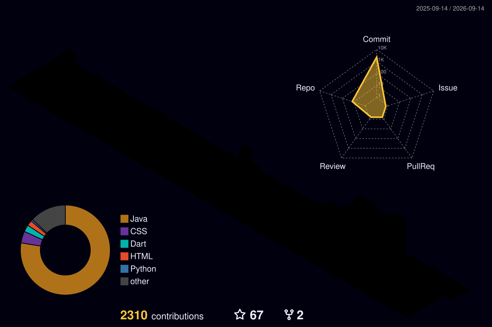

<p align="center">
  
</p>

<p align="center">
  <a href="https://github.com/Krish-CS?tab=followers">
    
  </a>
  <a href="https://github.com/Krish-CS?tab=repositories">
    
  </a>
  
</p>

<p align="center">
  
</p>

<p align="center">
  
</p>

## About Me

I am **Krishkanth Karthik**, a developer from Tiruchirappalli building across AI, data science, full-stack web, mobile apps and automation. My GitHub currently shows **24 public repositories**, with projects ranging from service marketplaces and e-learning platforms to prediction systems, chatbots, dashboards and cybersecurity practice work.

<table>
  <tr>
    <td><strong>Design identity</strong></td>
    <td>Aqua core, teal glow, warm gold highlights and clean white contrast inspired by my profile logo.</td>
  </tr>
  <tr>
    <td><strong>Build direction</strong></td>
    <td>Useful AI products, mobile applications, data visualization, web platforms and practical automation.</td>
  </tr>
  <tr>
    <td><strong>Main stack</strong></td>
    <td>Python, TypeScript, JavaScript, Dart, Kotlin, Jupyter Notebook, HTML, CSS and R.</td>
  </tr>
</table>

## Featured Repositories

<p align="center">
  <a href="https://github.com/Krish-CS/SKILLSHARE">
    
  </a>
  <a href="https://github.com/Krish-CS/PORTFOLIO">
    
  </a>
</p>

<p align="center">
  <a href="https://github.com/Krish-CS/E-Learning">
    
  </a>
  <a href="https://github.com/Krish-CS/API-INTEGRATION-AND-DATA-VISUALIZATION">
    
  </a>
</p>

## 3D Project Map

<p align="center">
  <a href="https://github.com/Krish-CS?tab=repositories">
    
  </a>
</p>

<p align="center">
  <a href="https://github.com/Krish-CS/SKILLSHARE"></a>
  <a href="https://github.com/Krish-CS/E-Learning"></a>
  <a href="https://github.com/Krish-CS/PORTFOLIO"></a>
</p>

<p align="center">
  <a href="https://github.com/Krish-CS/API-INTEGRATION-AND-DATA-VISUALIZATION"></a>
  <a href="https://github.com/Krish-CS/AI-CHATBOT-WITH-NLP"></a>
  <a href="https://github.com/Krish-CS/Calorie-Prediction-using-R"></a>
</p>

## Contribution Snake

<p align="center">
  <picture>
    <source media="(prefers-color-scheme: dark)" srcset="./dist/krish-snake-gold.svg" />
    
  </picture>
</p>

## 3D Contribution Skyline

<p align="center">
  
</p>

## GitHub Analytics

<p align="center">
  
  
</p>

<p align="center">
  
</p>

<p align="center">
  
</p>

<details>
  <summary><strong>Open the full clickable repository universe</strong></summary>

### Product And App Builds

| Repository | Main language | What it shows |
|---|---:|---|
| [SKILLSHARE](https://github.com/Krish-CS/SKILLSHARE) | Dart | Mobile marketplace connecting service professionals and customers. |
| [PORTFOLIO](https://github.com/Krish-CS/PORTFOLIO) | TypeScript | Personal portfolio and modern web presence. |
| [E-Learning](https://github.com/Krish-CS/E-Learning) | JavaScript | E-learning platform concept. |
| [JANVAANI-GOVERNMENT-SERVICES-HELPER](https://github.com/Krish-CS/JANVAANI-GOVERNMENT-SERVICES-HELPER) | TypeScript | Government services helper app. |
| [MEDUSA-WOMEN-SAFETY-APPLICATION](https://github.com/Krish-CS/MEDUSA-WOMEN-SAFETY-APPLICATION) | Kotlin | Android safety application idea. |
| [QUESTION-MIND](https://github.com/Krish-CS/QUESTION-MIND) | TypeScript | Question-focused web application. |
| [CASSANDRA](https://github.com/Krish-CS/CASSANDRA) | HTML | Web interface/project build. |
| [RESULTS-VIEWER-SITE-OPTIMIZATION-USING-FLASK](https://github.com/Krish-CS/RESULTS-VIEWER-SITE-OPTIMIZATION-USING-FLASK) | HTML | Flask-based result viewer with animated UI styling. |

### AI, Data And Analytics

| Repository | Main language | What it shows |
|---|---:|---|
| [API-INTEGRATION-AND-DATA-VISUALIZATION](https://github.com/Krish-CS/API-INTEGRATION-AND-DATA-VISUALIZATION) | Python | Weather API integration and visualization. |
| [AUTOMATED-REPORT-GENERATION](https://github.com/Krish-CS/AUTOMATED-REPORT-GENERATION) | Python | Automated CSV report generation. |
| [Personal-Fitness-Tracker](https://github.com/Krish-CS/Personal-Fitness-Tracker) | Python | Fitness tracking and prediction workflow. |
| [AI-CHATBOT-WITH-NLP](https://github.com/Krish-CS/AI-CHATBOT-WITH-NLP) | Python | Personal chatbot using Hugging Face API. |
| [WaterQualityPrediction](https://github.com/Krish-CS/WaterQualityPrediction) | Jupyter Notebook | Water quality prediction notebook. |
| [Week1](https://github.com/Krish-CS/Week1) | Jupyter Notebook | Water quality prediction week 1 model. |
| [Week2](https://github.com/Krish-CS/Week2) | Jupyter Notebook | Water quality prediction week 2 progress. |
| [Week3](https://github.com/Krish-CS/Week3) | Jupyter Notebook | Final water quality prediction work. |
| [EMPLOYEE-SALARY-PREDICTION](https://github.com/Krish-CS/EMPLOYEE-SALARY-PREDICTION) | Python | Salary prediction project. |
| [Twitter-Airline-Sentiment-ananlysis](https://github.com/Krish-CS/Twitter-Airline-Sentiment-ananlysis) | Python | Twitter airline sentiment analysis. |
| [Calorie-Prediction-using-R](https://github.com/Krish-CS/Calorie-Prediction-using-R) | R | Shiny and terminal calorie burn prediction system. |

### Cybersecurity Practice

| Repository | Main language | What it shows |
|---|---:|---|
| [CAESAR-CIPHER-TEXT-ENCRYPTION](https://github.com/Krish-CS/CAESAR-CIPHER-TEXT-ENCRYPTION) | Python | Classical encryption fundamentals. |
| [Image-Encryption-and-Decryption](https://github.com/Krish-CS/Image-Encryption-and-Decryption) | Python | Image encryption and decryption task. |
| [STRONG-PASSWORD-CHECKER](https://github.com/Krish-CS/STRONG-PASSWORD-CHECKER) | Python | Password strength checking logic. |
| [SIMPLE-KEYLOGGER](https://github.com/Krish-CS/SIMPLE-KEYLOGGER) | Python | Cybersecurity lab task for understanding input capture risks. |

</details>

## Build Themes

```text
AI and NLP       -> chatbots, report generation and prediction systems
Data science     -> notebooks, visualization, analysis and model workflows
Full-stack web   -> TypeScript, JavaScript, Flask and responsive interfaces
Mobile apps      -> Flutter, Dart and Kotlin projects
Security labs    -> encryption, password checking and defensive learning
```

<p align="center">
  <a href="https://github.com/Krish-CS?tab=repositories">
    
  </a>
</p>
